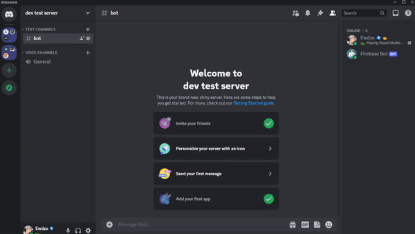
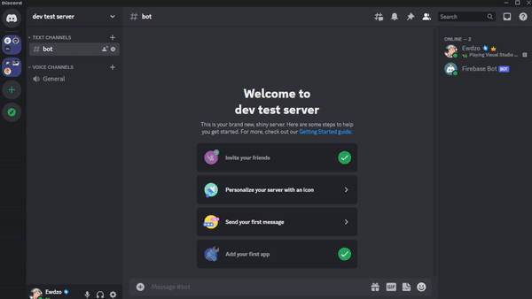
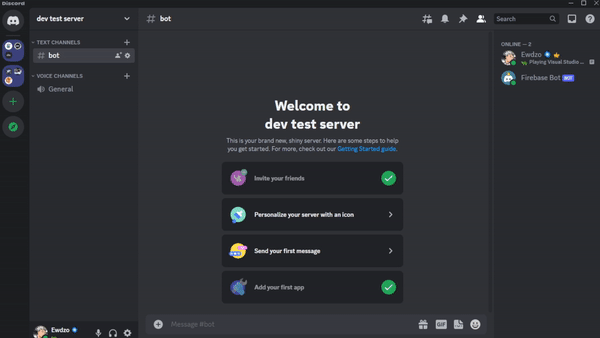

</img>


-----

# Firebase-Discord-Bot

Firebase-Discord-Bot is a discord bot created to download, upload and remove files from firebase, acting as a bridge to Firestore storage. 

Uses Firestore and Discord as main tools to work.


<h1>Features:</h1>

<ul>
    <li>Downloading Files</li>
    <li>Uploading Files</li>
    <li>Removing Files</li>
</ul>

-----

<h3>Downloading Files</h3>
</img>

-----

<h3>Uploading Files</h3>
</img>

-----

<h3>Removing Files</h3>
</img>

-----

<h1>Instructions</h1>

<ul><h3>Requirements:</h3> 
    <li>Firestore</li>
    <li>Discord App</li>
</ul>


Create a Firebase Database app in (https://firebase.google.com/) and insert it's credentials into .env as show in .env.example.
Create a Discord app in (https://discord.com/developers/applications) and insert it's token and client-id into .env as show in .env.example.

After setting up, you can start the project with: 

```bash
npm install
npm run dev
```
